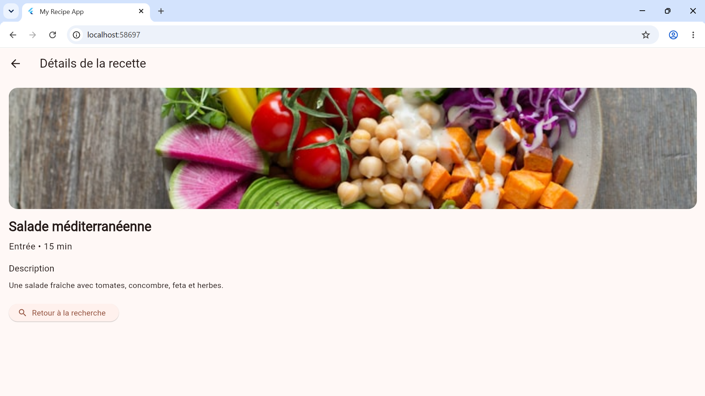
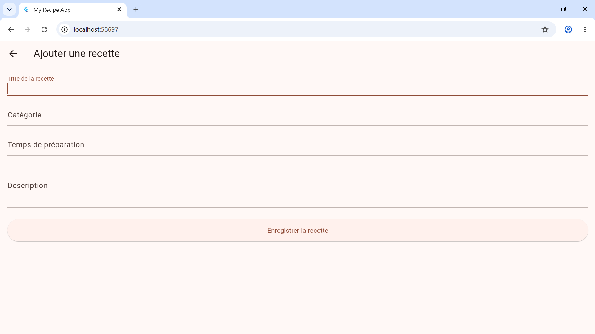

# My App

## Description

`my_app` est une application de recettes Flutter qui permet de consulter, rechercher et ajouter des recettes de manière fluide. L’application implémente une navigation propre avec `GoRouter`, un thème clair/sombre, et une interface adaptative pour mobile et tablette.
# AfroRecipe - Application Flutter Multi-écrans

Application mobile et web développée avec Flutter dans le cadre du projet de certification. Elle permet de découvrir, rechercher, détailler et ajouter des recettes de cuisine.

## 📱 Captures d'écran

| Écran d'Accueil | Écran de Détail | Formulaire d'Ajout |
| :---: | :---: | :---: |
|  |  |  |

---

## 🚀 Fonctionnalités
- **4 Écrans distincts** : Accueil, Recherche avec filtre, Détail de la recette, et Formulaire d'ajout.
- **Navigation déclarative** : Gestion des routes et paramètres dynamiques via **GoRouter**.
- **Recherche en temps réel** : Filtrage dynamique de la liste des recettes.
- **Formulaire sécurisé** : Saisie et validation de champs multiples (Titre, Catégorie, Temps, Description).
- **Thème dynamique** : Prise en charge native du mode clair (Light) et du mode sombre (Dark).
- **Design Responsive** : Adaptation automatique de la disposition selon la taille de l'écran (Mobile / Tablette / Desktop).

---
## Fonctionnalités implémentées

- Écran d'accueil (`HomeScreen`) avec affichage en grille responsive.
- Écran de recherche (`SearchScreen`) avec filtrage en temps réel.
- Écran de détail (`DetailScreen`) avec paramètre dynamique d’URL (`/detail/:id`).
- Écran de formulaire (`AddRecipeScreen`) avec validation sur au moins 3 champs texte.
- Navigation structurée avec `GoRouter` pour les routes `/`, `/search`, `/add` et `/detail/:id`.
- Support du mode clair et sombre via `ThemeData` et `ThemeMode.system`.
- Design adaptatif pour mobile et tablette à l’aide de `MediaQuery`.

## Détails techniques

- Utilisation d’un modèle de données `Recipe` dans `lib/models/recipe.dart`.
- Jeu de données source centralisé dans `lib/data/recipe_data.dart`.
- Widgets réutilisables dans `lib/widgets/` :
  - `RecipeCard`
  - `CustomHeader`
  - `ActionNavButton`
- Séparation claire entre données, UI et navigation.
- Plus de 8 widgets Flutter utilisés pour structurer l’application proprement.
- Route `/add` configurée dans `lib/main.dart` pour `AddRecipeScreen`.

## Lancement

1. Ouvrir un terminal dans le répertoire du projet :
   ```bash
   cd C:\Users\SALIF OUATTARA\Desktop\flutter\my_app
   ```
2. Installer les dépendances :
   ```bash
   flutter pub get
   ```
3. Lancer l’application :
   ```bash
   flutter run
   ```

## Notes

- Assurez-vous que votre environnement Flutter est correctement configuré.
- Le routeur `GoRouter` gère la navigation et les paramètres dynamiques pour des écrans cohérents.
