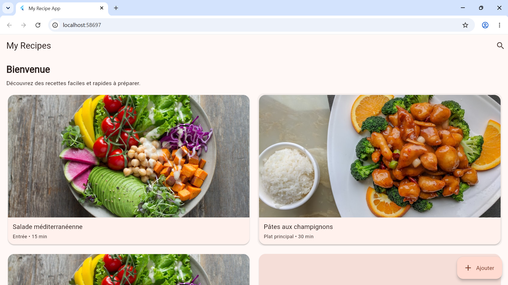
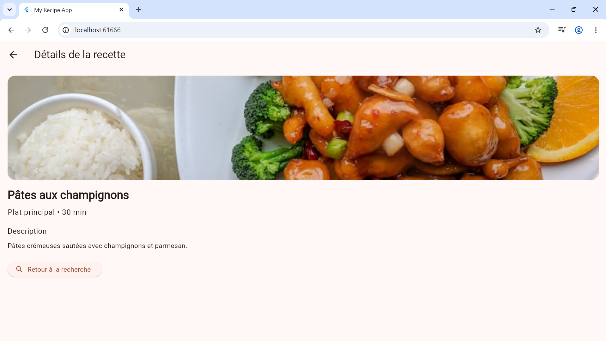
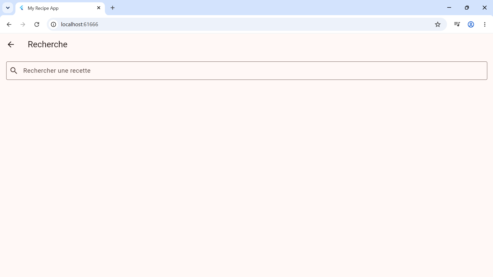

# My App - Application Flutter Multi-écrans

`my_app` est une application de recettes Flutter qui permet de consulter, rechercher et ajouter des recettes de manière fluide. Application mobile et web développée avec Flutter permettant de découvrir, rechercher, détailler et ajouter des recettes de cuisine avec une interface intuitive et responsive.

## 📱 Captures d'écran

| Écran d'Accueil | Écran de Détail | Formulaire d'Ajout |
| :---: | :---: | :---: |
|  |  |  |

## 🚀 Fonctionnalités
- **4 Écrans distincts** : Accueil, Recherche avec filtre, Détail de la recette, et Formulaire d'ajout.
- **Navigation déclarative** : Gestion des routes et paramètres dynamiques via **GoRouter**.
- **Recherche en temps réel** : Filtrage dynamique de la liste des recettes.
- **Formulaire sécurisé** : Saisie et validation de champs multiples (Titre, Catégorie, Temps, Description).
- **Thème dynamique** : Prise en charge native du mode clair (Light) et du mode sombre (Dark).
- **Design Responsive** : Adaptation automatique de la disposition selon la taille de l'écran (Mobile / Tablette / Desktop).

---

## 🏗️ Architecture

L'application suit le pattern **Repository Pattern** pour une séparation claire des responsabilités. Cette architecture facilite la testabilité, la maintenabilité et la scalabilité du projet.

### Hiérarchie Architecturale

```
Models
  ├─ recipe.dart (Classe Recette immuable)
  
Repositories
  ├─ recipe_repository.dart (Accès aux données centralisé)
  
Screens
  ├─ home_screen.dart (Affichage en grille)
  ├─ search_screen.dart (Recherche et filtrage)
  ├─ detail_screen.dart (Détails d'une recette)
  └─ add_recipe_screen.dart (Formulaire d'ajout)
  
Widgets
  ├─ recipe_card.dart (Carte de recette)
  ├─ custom_header.dart (En-tête personnalisé)
  └─ action_nav_button.dart (Bouton d'action)
```

### Repository Pattern

**RecipeRepository** (`lib/repositories/recipe_repository.dart`) centralise tout l'accès aux données :
- `getAllRecipes()` - Retourne la liste complète (immuable)
- `searchRecipes(String query)` - Recherche multi-champs (titre, catégorie, description)
- `getRecipesByCategory(String category)` - Filtre par catégorie
- `getRecipeById(String id)` - Récupère une recette spécifique
- `addRecipe(Recipe recipe)` - Ajoute une nouvelle recette
- `getAllCategories()` - Liste les catégories uniques
- `getRecipeCount()` - Nombre total de recettes
- `searchRecipesLimited(String query, int limit)` - Recherche paginée

### Navigation et Routing

L'application utilise **GoRouter** pour une navigation déclarative :
- `/` - HomeScreen (Affichage principal en grille)
- `/search` - SearchScreen (Recherche et filtrage)
- `/add` - AddRecipeScreen (Formulaire d'ajout de recette)
- `/detail/:id` - DetailScreen (Détail paramétré)

### Modèle de Données

**Recipe** (`lib/models/recipe.dart`) est une classe immuable avec :
- `id` - Identifiant unique
- `title` - Titre de la recette
- `category` - Catégorie (Entrée, Plat principal, Boisson, Dessert)
- `prepTime` - Temps de préparation
- `description` - Description complète (20+ caractères)
- `imageUrl` - URL de l'image

### Widgets Réutilisables

- **RecipeCard** - Affiche une carte de recette avec image, titre, catégorie et temps. Utilisé dans HomeScreen et SearchScreen.
- **CustomHeader** - En-tête personnalisé avec titre et sous-titre pour une mise en page cohérente.
- **ActionNavButton** - Bouton d'action stylisé avec icône et libellé suivant Material 3.

---

## 🚀 Démarrage et Utilisation

1. Ouvrir un terminal dans le répertoire du projet :
   ```bash
   cd C:\Users\SALIF OUATTARA\Desktop\flutter\my_app
   ```
2. Installer les dépendances :
   ```bash
   flutter pub get
   ```
3. Lancer l'application :
   ```bash
   flutter run
   ```

## 🧪 Suite de Tests

Pour exécuter les tests unitaires et les tests de widgets :

```bash
flutter test
```

L'application inclut une suite de tests située dans le dossier `test/` :
- `test/repositories/recipe_repository_test.dart` — tests unitaires pour `RecipeRepository`.
- `test/widgets_test.dart` — tests de widgets (covers `RecipeCard`, `CustomHeader`, `ActionNavButton`).
- `test/search_add_screen_test.dart` — tests d'intégration pour `SearchScreen` et `AddRecipeScreen` (utilise `GoRouter` pour l'intégration).
- `test/recipe_model_test.dart` — tests pour le modèle `Recipe`.

## 🛠️ Technologies Utilisées

- **Flutter** 3.12.2+
- **GoRouter** 8.0.0+ (Navigation déclarative)
- **Material 3** Design System
- **flutter_test** Framework pour les tests
- **flutter_lints** Analyse statique du code

## 📝 Notes Importantes

- L'application suit le **pattern Repository** pour une architecture scalable et testable
- Tous les **widgets sont réutilisables** et documentés via doc comments
- La **navigation gère les paramètres dynamiques** pour un routage cohérent
- Le **formulaire d'ajout persiste les recettes** via RecipeRepository
- **Support complet du thème** clair et sombre (Material 3)
- Assurez-vous que votre environnement **Flutter est correctement configuré**
